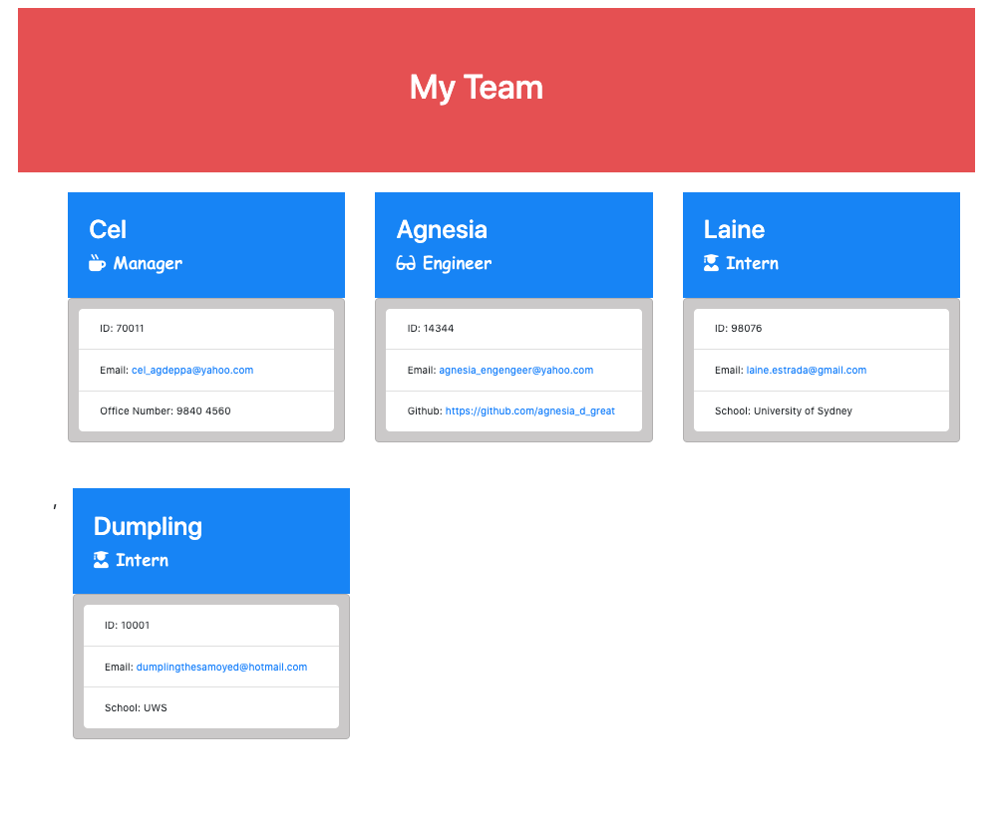

# ProfileGenerator

This application will generate a webpage based on the information gathered from the series of questions on the command prompt. It will take the information about the employee, wether the employee is a Manager, Engineer or an Intern.

This application is build with Node.js.

## Installation
Like the previous homework, I started with the inquirer prompt questions then I created functions for the follow-up questions for each role and push the values collected to the const declared. I saved all the java script that's related to functionality on creating the output in index.js

I also created render.js which focus on pulling the data from node.js and pushing it to the .html file. I made 4 .html file for template of every role and the mail template for the output file.

I have created an "output" folder so that it will be easier for me to look for the rendered html and called the file "myteam.html".

## Usage
[Team_Profile_Generator](https://github.com/Criscel/ProfileGenerator)

